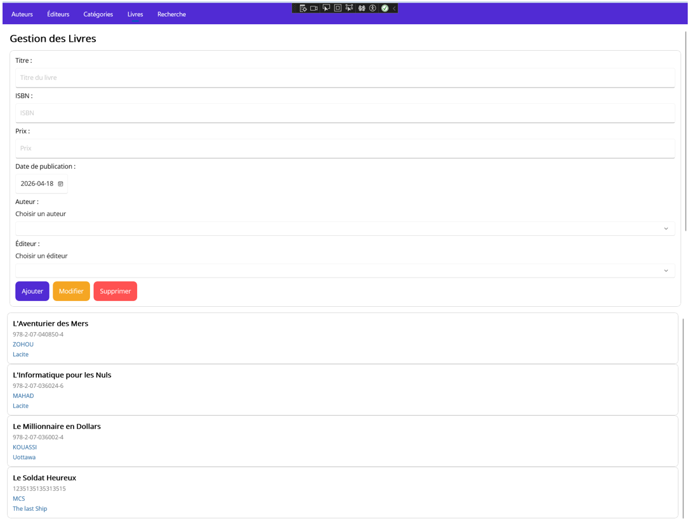
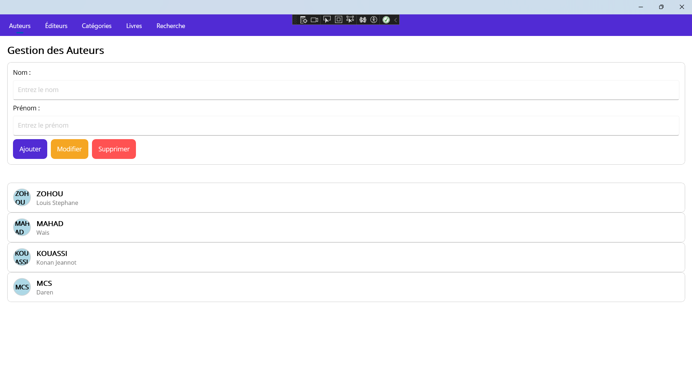
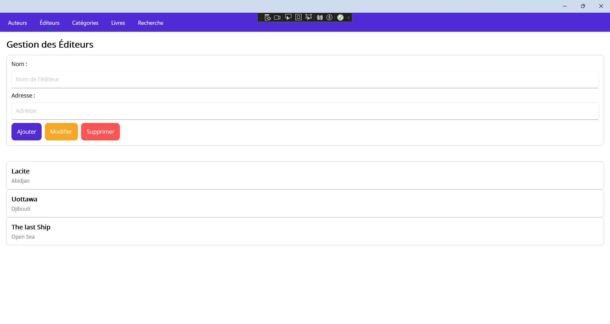
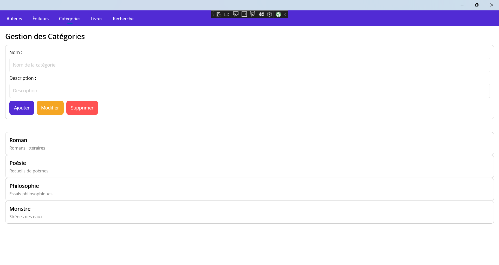
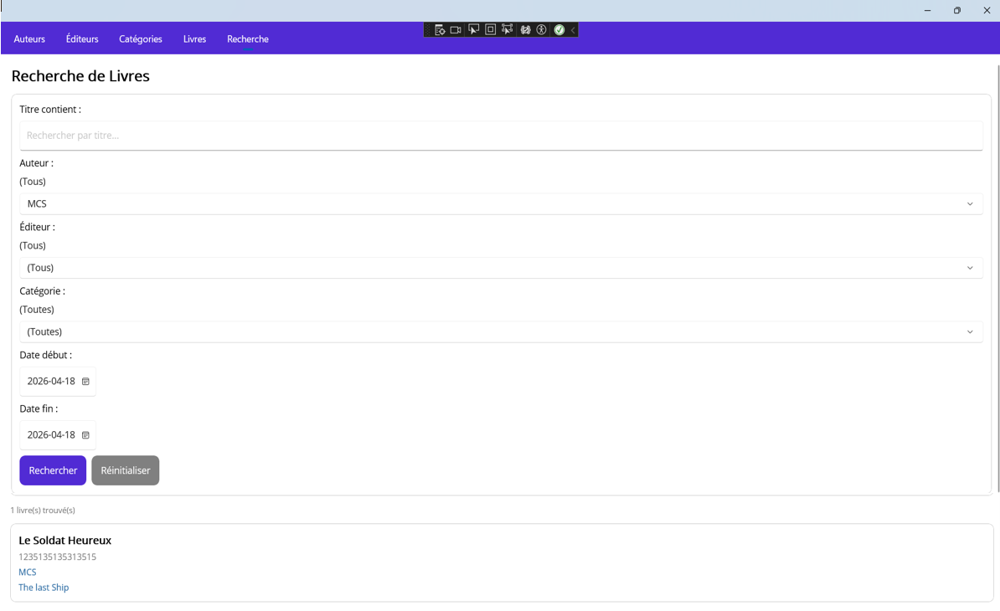
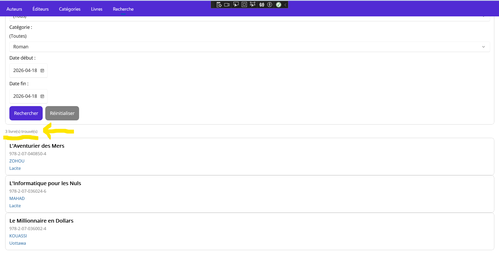

# BiblioKowazo MAUI

Application multiplateforme de gestion de bibliothèque développée avec **.NET MAUI** et **Entity Framework Core**.

## Aperçu

BiblioKowazo permet de gérer un catalogue de livres avec leurs auteurs, éditeurs et catégories. L'application offre des opérations CRUD complètes sur chaque entité, une recherche multicritère et un contrôle d'intégrité des données.

## Captures d'écran

| Livres | Auteurs | Éditeurs |
|--------|---------|----------|
|  |  |  |

| Catégories | Recherche | CRUD |
|------------|-----------|------|
|  |  |  |

## Fonctionnalités

- **CRUD complet** sur les livres, auteurs, éditeurs et catégories
- **Recherche multicritère** : filtrage par titre, auteur, éditeur, catégorie et intervalle de dates (filtres cumulatifs ET)
- **Intégrité des données** : validation des champs obligatoires, unicité ISBN, gestion des dépendances (CASCADE / RESTRICT)
- **Navigation par onglets** via TabbedPage

## Stack technique

| Composant | Technologie |
|-----------|-------------|
| Framework | .NET 9 / MAUI |
| ORM | Entity Framework Core 9 |
| Base de données | SQL Server |
| Langage | C# |
| Interface | XAML |

## Modèle de données

```
Auteur (1) ──→ (N) Livre (1) ←── (1) FicheDetail
Editeur (1) ──→ (N) Livre (N) ←──→ (M) Categorie
                          └── via LivreCategorie
```

| Relation | Cardinalité | Suppression |
|----------|-------------|-------------|
| Auteur → Livre | 1-N | CASCADE |
| Editeur → Livre | 1-N | RESTRICT |
| Livre ↔ FicheDetail | 1-1 | CASCADE |
| Livre ↔ Categorie | N-M | via LivreCategorie |

## Prérequis

- .NET 9 SDK
- SQL Server (local ou distant)
- Visual Studio 2022+ avec la charge de travail .NET MAUI

## Installation

```bash
git clone https://github.com/Darenmcs/BiblioKowazoMaui.git
cd BiblioKowazoMaui
```

1. Ouvrir `BiblioKowazoMaui.sln` dans Visual Studio
2. Configurer la connexion SQL Server dans `BiblioContext.cs`
3. Exécuter le script `ScriptMaui.sql` pour créer la base de données
4. Lancer l'application (Windows, Android ou iOS)

## Auteur

**Daren MCS** — [GitHub](https://github.com/Darenmcs)
